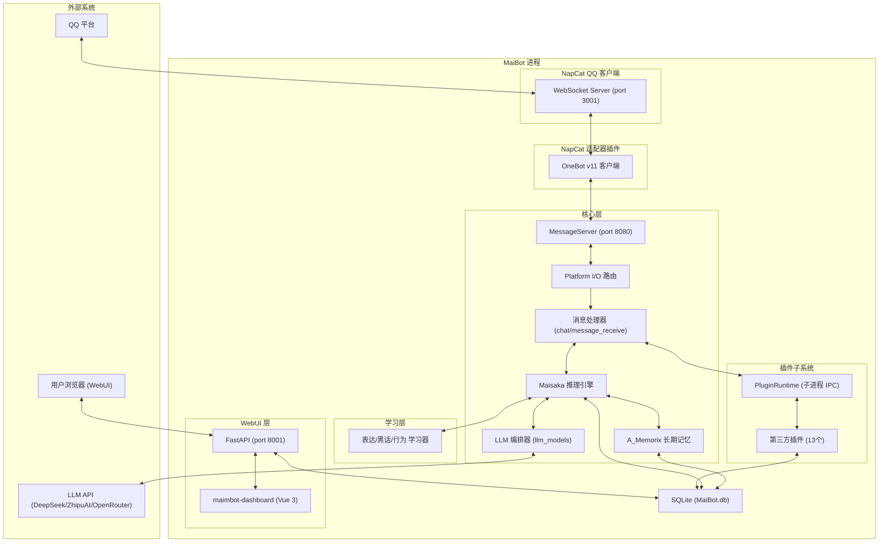
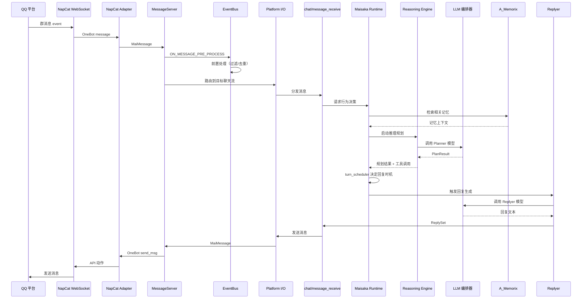
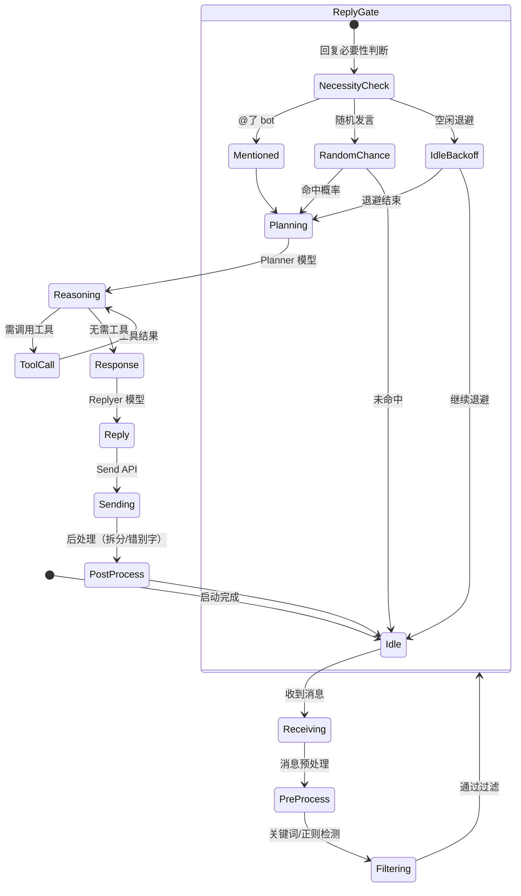
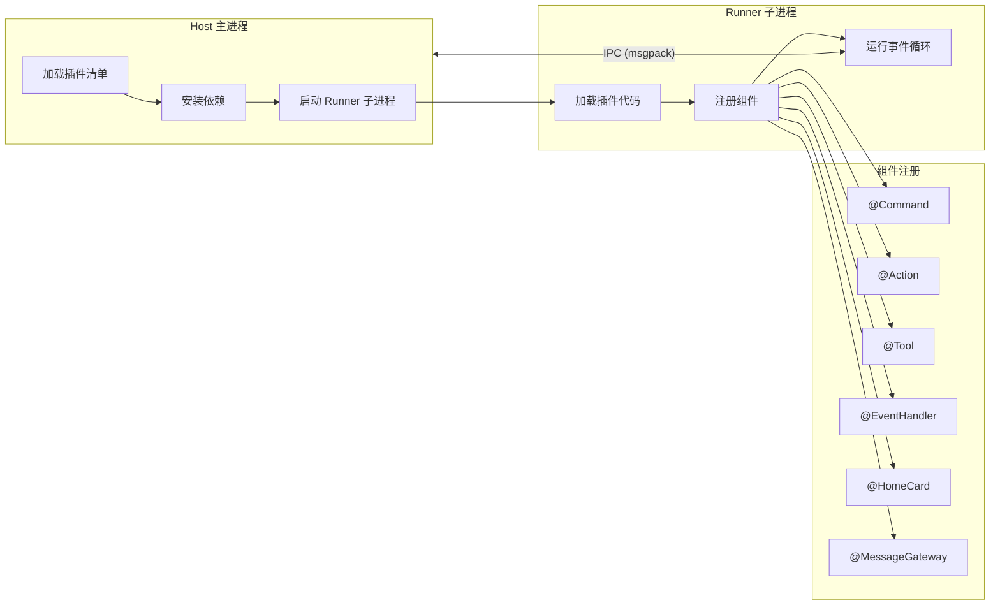

# 系统架构文档

## 概述

MaiBot 是一个基于大语言模型（LLM）的可交互智能体系统，专注于类人化 QQ 群聊/私聊对话。它通过 NapCat QQ 协议客户端实现与 QQ 平台的双向消息通信，内置 Maisaka 推理引擎驱动智能体行为决策，配合长期记忆系统（A_Memorix）积累用户认知，以及丰富的插件生态扩展能力。

系统采用 Python 3.12+ 异步架构，核心运行在双层进程模型（Runner + Worker）上，Worker 进程内包含消息收发、智能体推理、学习模块、记忆存储、WebUI 管理面板、插件运行时等多子系统。整个系统通过 FastAPI 提供 WebUI（端口 8001），通过 maim-message WebSocket 协议（端口 8080）与适配器插件通信，再由 NapCat 适配器连接 NapCat QQ 客户端的 OneBot v11 WebSocket（端口 3001）。

## 技术栈

**语言与运行时**
- Python >= 3.12
- asyncio 异步事件循环

**框架**
- FastAPI + Uvicorn — WebUI API 服务
- maim-message — 核心消息协议与 WebSocket 通信
- maimbot-plugin-sdk >= 2.7.1 — 插件开发框架
- maimbot-dashboard >= 1.5.6 — WebUI 前端 (Vue 3 + TypeScript)

**数据存储**
- SQLite — 主数据库 (SQLModel/SQLAlchemy ORM)
- FAISS — 长期记忆向量检索
- 文件系统 — 图片缓存、表情包、记忆数据

**LLM 集成**
- OpenAI 兼容客户端 — DeepSeek、ZhipuAI、OpenRouter
- Google GenAI — Gemini 接口

**关键库**
- structlog — 结构化日志
- tomlkit — TOML 配置解析
- Rich + prompt-toolkit — 终端 UI
- jieba + ahocorasick-rs — 中文分词与关键词检测
- pyarrow + pandas — 长期记忆数据处理
- playwright — 浏览器自动化（插件渲染）
- msgpack — 消息序列化
- pydantic — 数据验证

## 项目结构

```
MaiBot/
├── bot.py                    # 主入口：双层进程（Runner + Worker）
├── saka.py                   # MaiSaka 独立终端对话入口
├── pyproject.toml            # 项目元数据与依赖声明
├── requirements.txt          # pip 兼容依赖
├── uv.lock                   # uv 依赖锁
├── Dockerfile                # 生产环境容器镜像
├── docker-compose.yml        # 多容器编排
├── docker-entrypoint.sh      # 容器启动脚本
├── config/                   # 配置文件
│   ├── bot_config.toml       # Bot 主配置（人格、聊天、记忆、WebUI 等）
│   └── model_config.toml     # LLM 模型与 API 提供商配置
├── src/                      # 核心源码
│   ├── main.py               # MainSystem 类：组件编排与任务调度
│   ├── A_memorix/            # 长期记忆子系统
│   ├── chat/                 # 聊天子系统（消息接收、回复生成、心跳流、图片系统）
│   ├── cli/                  # 终端 CLI（控制台、MaiSaka CLI）
│   ├── common/               # 公共模块（数据库、消息服务、国际化、工具函数）
│   ├── config/               # 配置子系统（ConfigManager、配置类、文件监听、升级钩子）
│   ├── core/                 # 核心框架（事件总线、类型定义、工具注册、权限管理）
│   ├── emoji_system/         # 表情包子系统
│   ├── learners/             # 学习子系统（表达、黑话、行为）
│   ├── llm_models/           # LLM 模型客户端（多厂商适配、编排器）
│   ├── maisaka/              # 麦麦交互引擎（推理、调度、上下文、工具、记忆）
│   ├── mcp_module/           # MCP 协议子系统
│   ├── person_info/          # 人物信息管理
│   ├── platform_io/          # 平台 I/O 抽象层（路由、适配器策略、去重）
│   ├── plugin_runtime/       # 插件运行子系统（子进程 IPC 架构）
│   ├── plugins/              # 内置插件（插件管理）
│   ├── prompt/               # 提示词管理
│   ├── services/             # 服务层（数据库、LLM、发送、统计等）
│   └── webui/                # WebUI 后端（FastAPI 路由、认证、中间件）
├── plugins/                  # 用户安装的第三方插件（13 个）
├── dashboard/                # WebUI 前端项目（Vue 3 + TypeScript）
├── data/                     # 运行时数据（数据库、图片缓存、表情包、记忆）
├── logs/                     # 运行时日志
├── locales/                  # 国际化（zh-CN/en-US/ja-JP/ko）
├── prompts/                  # LLM 提示词模板（多语言 + 版本管理）
├── pytests/                  # 测试套件
├── depends-data/             # 运行时静态数据依赖
├── changelogs/               # 变更记录
├── scripts/                  # 辅助脚本
├── temp/                     # 临时文件
└── .github/                  # CI/CD 工作流
```

**入口点**
- `bot.py` — 应用启动入口，Runner 进程 fork Worker 进程
- `src/main.py` — MainSystem 类：系统初始化、组件编排、任务调度
- `saka.py` — MaiSaka 独立终端对话入口

## 子系统

### 双层进程模型
**目的**: 进程级守护与热重启  
**位置**: `bot.py`  
**关键文件**: `bot.py`  
**依赖**: 无  
**被依赖**: 所有子系统  
Runner 进程以子进程方式启动 Worker，监控 Worker 退出码，若为 42 则自动重启 Worker。Worker 进程运行完整的 bot 业务逻辑。

### 聊天子系统
**目的**: 消息接收、回复生成、发送管理  
**位置**: `src/chat/`  
**关键文件**: `message_receive/bot.py`, `replyer/`, `heart_flow/`, `image_system/`  
**依赖**: platform_io（消息路由）、maisaka（智能体决策）、llm_models（LLM 调用）  
**被依赖**: main.py（注册消息处理器）

### 麦麦交互引擎 (Maisaka)
**目的**: 智能体行为决策核心，包含推理、回复时机判断、上下文管理、工具调用  
**位置**: `src/maisaka/`  
**关键文件**: `runtime.py` (2000+ 行), `reasoning_engine.py`, `turn_scheduler.py`, `turn_gates.py`, `idle_backoff.py`  
**依赖**: llm_models, A_memorix, core/event_bus, core/tooling  
**被依赖**: chat/（回复生成入口）

### 长期记忆系统 (A_Memorix)
**目的**: 基于知识图谱和向量检索的长期记忆，支持人物画像、事实存储、上下文检索  
**位置**: `src/A_memorix/`  
**关键文件**: 内部模块（图谱、向量检索、嵌入、Episode、人物画像）  
**依赖**: FAISS, pyarrow, pandas, LLM 嵌入模型  
**被依赖**: maisaka/（注入记忆上下文）

### 插件运行子系统
**目的**: 基于子进程 IPC 的插件沙箱环境，隔离插件与主进程，支持热加载  
**位置**: `src/plugin_runtime/`  
**关键文件**: `integration.py`, `runner/`, `host/`, `protocol/`, `transport/`  
**依赖**: maimbot-plugin-sdk, playwright  
**被依赖**: main.py（启动插件运行时）

### 平台 I/O 抽象层
**目的**: 统一多平台（QQ、终端等）消息路由与适配器策略  
**位置**: `src/platform_io/`  
**关键文件**: 路由表、适配器策略、消息去重  
**依赖**: maim-message 协议  
**被依赖**: chat/（消息收发）

### WebUI 子系统
**目的**: 基于 FastAPI 的管理面板后端，提供配置、数据、插件的 Web 管理接口  
**位置**: `src/webui/`  
**关键文件**: `app.py`, `webui_server.py`, `routes.py`, `routers/` (19 个子路由模块)  
**依赖**: config/, services/, database/  
**被依赖**: main.py（启动 WebUI 服务线程）

### 配置子系统
**目的**: TOML 配置解析、热加载、文件监听、版本升级  
**位置**: `src/config/`  
**关键文件**: `config.py`, `config_base.py`, `file_watcher.py`, `config_upgrade_hooks.py`  
**依赖**: tomlkit, watchfiles  
**被依赖**: 所有子系统（获取配置）

## 架构图

### 系统架构概览



### 消息处理时序



### 智能体决策状态机



### 插件生命周期


