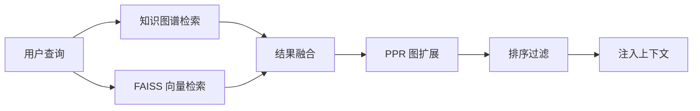

# 长期记忆系统 (A_Memorix)

A_Memorix 是 MaiBot 的知识图谱与向量检索混合记忆系统，用于长期积累对用户和对话的认知。

## 什么是 A_Memorix？

A_Memorix 结合了知识图谱的结构化记忆和 FAISS 向量检索的语义搜索能力。它从聊天对话中自动抽取实体、关系和事实，构建人物画像（Person Profile），并在后续对话中注入相关记忆上下文，使 Bot 展现出跨会话的记忆能力。

**关键特征**:
- 知识图谱节点管理（实体、事实、事件）
- FAISS 向量检索（语义相似度搜索）
- PPR (Personalized PageRank) 图算法增强检索
- 双向量池（实体级 + 段落级）
- 自动 Episode 生成（对话片段聚类摘要）
- 人物画像定期刷新（证据分类 + 活跃窗口）
- 记忆演化（半衰期衰减 + 访问加强）
- 反馈纠错与模糊修正

## 代码位置

| 方面 | 位置 |
|------|------|
| 总目录 | `src/A_memorix/` |
| 配置 | `config/bot_config.toml` `[a_memorix]` 段 |
| WebUI | `src/webui/routers/memory_router.py` |

## 关键配置

| 配置段 | 关键参数 | 描述 |
|--------|---------|------|
| `a_memorix.integration` | 查询工具、画像注入、记忆写回 | 行为控制开关 |
| `a_memorix.embedding` | model_name, dimension, quantization | 向量化配置 |
| `a_memorix.retrieval` | top_k, alpha, PPR, 融合方法 | 检索策略配置 |
| `a_memorix.episode` | 自动生成、时间窗口 | Episode 配置 |
| `a_memorix.person_profile` | 刷新间隔、证据分类 | 人物画像配置 |
| `a_memorix.memory` | 半衰期、裁剪、加强 | 记忆演化配置 |

## 记忆搜索流程

1. 同时执行图谱检索和向量检索
2. 结果融合（可配置权重和方法）
3. PPR 图遍历扩展关联节点
4. 按相关度排序并过滤
5. 将记忆上下文注入 LLM 请求
