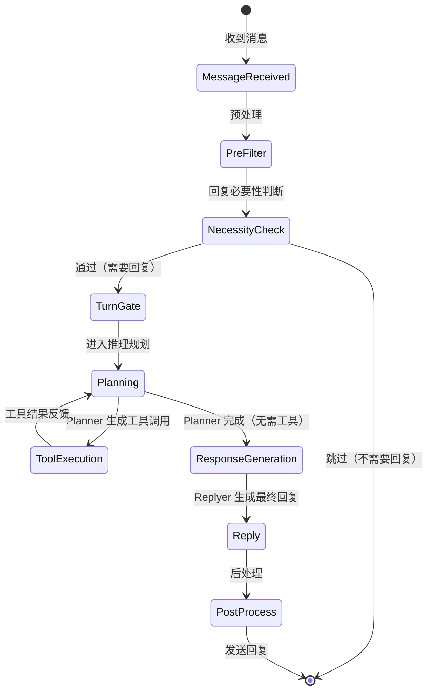

# Maisaka Runtime

MaiBot 的智能体行为决策核心，负责从消息接收、推理规划、工具调用到回复生成的全流程编排。

## 什么是 Maisaka Runtime？

Maisaka Runtime 是 MaiBot 的"大脑"，它在收到消息后判断是否需要回复、通过 LLM 规划行为、调用工具执行任务、调度回复时机，最后生成回复文本。它不同于传统的请求-响应模型，而是模拟人类在群聊中的自然交互节奏——该说话时说话，该沉默时沉默。

**关键特征**:
- 基于 LLM 的多步推理规划（Planner + Replyer 两阶段）
- 上下文感知的回复时机控制（知道什么时候该回复）
- 空闲退避机制（群聊冷场时主动发起话题）
- 工具调用与浏览器操作能力
- 长期记忆集成的上下文注入

## 代码位置

| 方面 | 位置 |
|------|------|
| 主运行时 | `src/maisaka/runtime.py` |
| 推理引擎 | `src/maisaka/reasoning_engine.py` |
| 聊天循环 | `src/maisaka/chat_loop_service.py` |
| 轮次调度 | `src/maisaka/turn_scheduler.py` |
| 轮次门控 | `src/maisaka/turn_gates.py` |
| 回复必要性 | `src/maisaka/reply_necessity.py` |
| 空闲退避 | `src/maisaka/idle_backoff.py` |
| 模式策略 | `src/maisaka/mode_policy.py` |
| 上下文管理 | `src/maisaka/context/` |
| 工具系统 | `src/maisaka/builtin_tool/`, `src/maisaka/browser_tool/` |
| 记忆集成 | `src/maisaka/memory/` |
| 视觉处理 | `src/maisaka/visual/` |

## 生命周期

## 回复时机控制策略

Maisaka 采用多层门控机制决定是否回复：

1. **必要性判断** (`reply_necessity.py`): 基于消息内容评估是否需要 Bot 参与
2. **提及检查**: 是否 @了 Bot，提及则必须回复
3. **随机发言**: 根据配置的发言频率，以概率决定是否主动加入
4. **空闲退避** (`idle_backoff.py`): 群聊长时间无消息时，退避等待减少风险

## 推理流程

1. Planner 模型接收消息上下文化和记忆注入内容
2. 生成 PlanResult（包含可能的工具调用和规划思考）
3. 如有工具调用，执行工具并将结果反馈给 Planner
4. Planner 确定需要回复后，将上下文传递给 Replyer
5. Replyer 模型生成最终回复文本
6. 回复通过后处理流程（拆分、错别字模拟等）后发送
