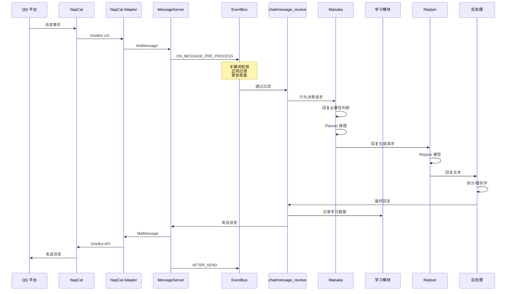

# 消息流

MaiBot 内部消息从接收到回复的完整流转路径。

## 什么是消息流？

消息流描述了从 QQ 平台收到一条消息开始，到 Bot 最终发出回复的完整数据链路。消息在多个子系统和组件间传递，经过预处理、路由、智能体推理、学习记录、回复生成、后处理等阶段。

**关键特征**:
- 多平台统一抽象（通过 maim-message 协议）
- 事件总线驱动的前后置处理链
- 适配器策略控制消息路由
- 消息去重和保护机制

## 消息处理流程

## 事件总线

MaiBot 的事件总线 (`src/core/event_bus.py`) 是所有子系统间的松耦合通信机制。支持拦截型和非拦截型事件处理器。

### 事件类型

| 事件 | 时机 | 用途 |
|------|------|------|
| `ON_START` | 系统启动完成 | 定时任务注册 |
| `ON_STOP` | 系统关闭前 | 清理和保存 |
| `ON_MESSAGE_PRE_PROCESS` | 消息到达后、处理前 | 过滤、屏蔽、关键词检测 |
| `ON_MESSAGE` | 消息处理时 | 核心消息处理 |
| `ON_PLAN` | Planner 推理完成 | 规划结果审计 |
| `POST_LLM` | LLM 调用后 | 日志、统计 |
| `AFTER_LLM` | LLM 响应后 | 后处理 |
| `POST_SEND_PRE_PROCESS` | 发送前 | 消息修改 |
| `POST_SEND` | 发送后 | 发送确认 |
| `AFTER_SEND` | 发送完成后 | 统计、学习 |

## 消息去重

平台 I/O 抽象层 (`src/platform_io/`) 实现了消息 ID 去重，防止同一消息被重复处理。
