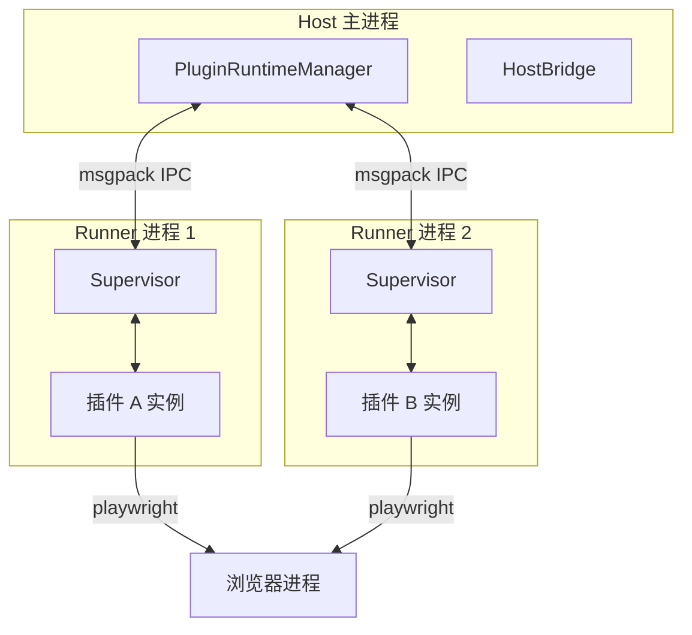

# 插件系统

MaiBot 的插件系统基于 `maimbot-plugin-sdk` 构建，支持六种组件类型和子进程隔离运行。

## 什么是插件系统？

插件系统允许用户和开发者扩展 MaiBot 的功能而不修改核心代码。插件可以注册命令、动作、工具、事件处理器、首页卡片和消息网关。新版插件运行时（PluginRuntime）将插件运行在独立子进程中，通过 msgpack IPC 与主进程通信，实现进程隔离和热加载。

**关键特征**:
- 六种组件类型：Command / Action / Tool / EventHandler / HomeCard / MessageGateway
- 子进程隔离（IPC 通信）保障主进程稳定性
- 热加载/热卸载
- 每个插件独立事件循环
- Playwright 浏览器环境支持渲染
- 配置热更新

## 代码位置

| 方面 | 位置 |
|------|------|
| SDK | `maimbot-plugin-sdk` (pip 包) |
| 运行时 | `src/plugin_runtime/` |
| 协议层 | `src/plugin_runtime/protocol/` |
| 传输层 | `src/plugin_runtime/transport/` |
| 内置插件 | `src/plugins/built_in/plugin_management/` |
| 用户插件 | `plugins/` (13个第三方插件) |
| SDK 文档 | `https://github.com/Mai-with-u/maibot-plugin-sdk/blob/main/docs/guide.md` |

## 组件类型

| 组件 | 装饰器 | 触发方式 | 典型用途 |
|------|--------|---------|---------|
| Command | `@Command(name)` | 用户发送 `/name` 命令 | 快捷指令、信息查询 |
| Action | `@Action(name)` | Planner 模型决定激活 | 语义触发的行为 |
| Tool | `@Tool(name)` | LLM 函数调用 | 数据查询、外部 API |
| EventHandler | `@EventHandler(type)` | 系统事件触发 | 日志记录、消息转发 |
| HomeCard | `@HomeCard(title)` | WebUI 仪表盘渲染 | 信息展示入口 |
| MessageGateway | `@MessageGateway(name)` | 平台消息到达 | 适配器（如 NapCat） |

## 运行架构



## 插件配置

每个插件定义 `config_model` 继承 `PluginConfigBase`，配置存储在插件目录的 `config.toml` 中：

```python
from maimbot_plugin_sdk import PluginConfigBase

class MyConfig(PluginConfigBase):
    api_key: str = ""
    enabled: bool = True
    max_retries: int = 3
```

配置通过 WebUI 插件管理页面或主配置文件进行编辑，修改后自动触发 `on_config_update()` 回调。
